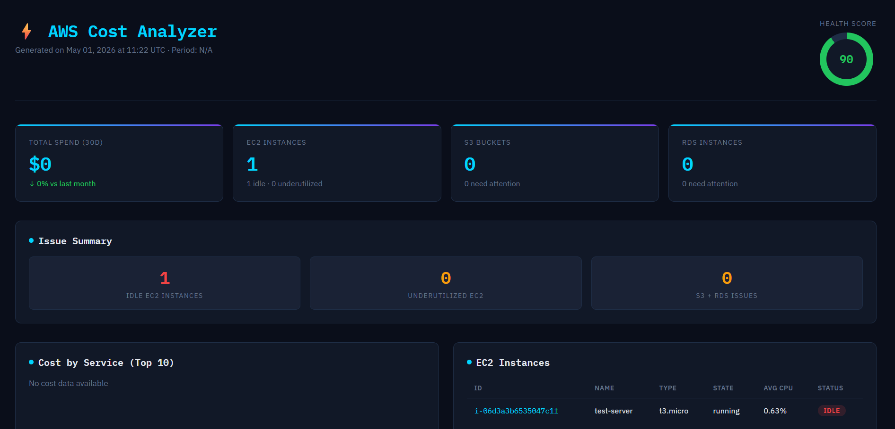

# ⚡ AWS Infrastructure Cost Analyzer

A Python CLI tool that analyzes your AWS infrastructure for idle and underutilized resources, and generates a beautiful HTML cost optimization report.


---

## 🔍 What It Does

- **EC2 Analysis** — Detects idle instances (CPU < 5%) and underutilized ones (CPU < 20%) over the last 7 days
- **S3 Analysis** — Flags empty buckets, missing lifecycle policies, and disabled versioning
- **RDS Analysis** — Identifies zombie databases (zero connections), oversized instances, and costly Multi-AZ setups
- **Cost Explorer** — Fetches 30-day spend, compares to previous month, and breaks down cost by service
- **HTML Report** — Generates a dark-themed, production-quality report with tables and cost visualizations

---

## 🚀 Quick Start

### 1. Clone & Install

```bash
git clone https://github.com/jyotishreedash/aws-cost-analyzer.git
cd aws-cost-analyzer
pip install -r requirements.txt
```

### 2. Configure AWS Credentials

```bash
aws configure
# or use environment variables:
export AWS_ACCESS_KEY_ID=...
export AWS_SECRET_ACCESS_KEY=...
export AWS_DEFAULT_REGION=us-east-1
```

### 3. Run

```bash
python main.py
```

The report will be saved to `reports/cost_report.html`.

---

## ⚙️ Options

```
python main.py [OPTIONS]

Options:
  --profile TEXT     AWS profile name (default: default)
  --region TEXT      AWS region (default: us-east-1)
  --output TEXT      Output HTML report path (default: reports/cost_report.html)
  --skip-costs       Skip Cost Explorer (requires billing permissions)
```

### Examples

```bash
# Use a specific AWS profile and region
python main.py --profile prod --region ap-south-1

# Save report to a custom location
python main.py --output /tmp/my-report.html

# Skip billing data (if you don't have Cost Explorer access)
python main.py --skip-costs
```

---

## 🔑 Required IAM Permissions

```json
{
  "Version": "2012-10-17",
  "Statement": [
    {
      "Effect": "Allow",
      "Action": [
        "ec2:DescribeInstances",
        "cloudwatch:GetMetricStatistics",
        "s3:ListBuckets",
        "s3:GetBucketVersioning",
        "s3:GetBucketLifecycleConfiguration",
        "rds:DescribeDBInstances",
        "ce:GetCostAndUsage",
        "sts:GetCallerIdentity"
      ],
      "Resource": "*"
    }
  ]
}
```

---

## 📁 Project Structure

```
aws-cost-analyzer/
├── main.py                          # CLI entry point
├── requirements.txt
├── aws_cost_analyzer/
│   ├── __init__.py
│   ├── ec2_analyzer.py              # EC2 utilization analysis
│   ├── s3_analyzer.py               # S3 bucket health checks
│   ├── rds_analyzer.py              # RDS idle/oversized detection
│   ├── cost_explorer.py             # AWS Cost Explorer integration
│   └── report_generator.py          # HTML report generation
├── reports/                         # Generated reports (gitignored)
└── tests/
    └── test_analyzer.py
```

---

## 🧪 Run Tests

```bash
python -m pytest tests/ -v
```

---

## 💡 Inspiration

Built from real-world experience reducing AWS cloud costs by **45.7%** at a production environment through IaC optimization and resource rightsizing. This tool automates the discovery phase of that work.

## 📸 Sample Report


---

## 📄 License

MIT License — free to use, modify, and distribute.
